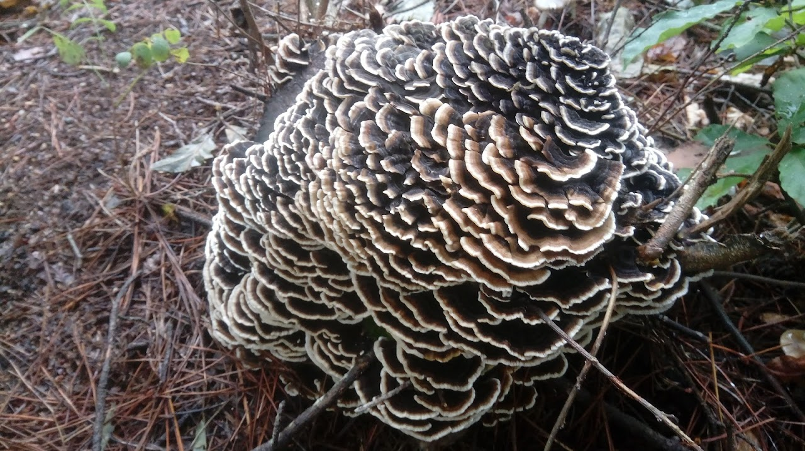

“올해엔 버섯이 많겠어.” 

고추를 따다 말고 아내가 이렇게 말합니다. 제가 피식 웃자 아내도 따라 웃습니다.<!--truncate--> 손을 재게 놀려도 늦은 오후에나 끝날 일이라 몸도 마음도 바빠집니다. 염화미소까지는 아니더라도 부부지간에 심심상인, 이심전심으로 오늘은 덤바우 뒷산을 오를 모양입니다. 

이러구러 일을 마치고 뒷산 오르는 길에 접어들자 아내는 참깨 베는 일을 잊었다며, 아까운 깨알 다 쏟아지게 생겼다고 걱정이 늘어졌습니다. 이른 봄 나물산행 하면서는 채소 모종 더뎌진다고 걱정하던 아내가 떠올라 빙그레 웃게 됩니다.    
 
 산의 품에 들자마자 눅눅한 기운이 훅 끼칩니다. 땅은 폭신해서 밟을 때마다 달콤한 향이 일어나 온몸에 안개처럼 퍼져나갑니다. 산은 늘 그렇습니다. 온통 얼어붙는 겨울에도 숲을 이룬 산의 체취는 늘 싸하고 달콤합니다. 
 
 비릿하면서도 코끝을 스치는 알싸한, 그런데도 얼큰한 그런 숨결을 멈추지 않는 산입니다. 그에 취했는지 밭 걱정, 농사 근심 다 잊은 듯 아내의 걸음이 가볍고 저 역시 황홀합니다.

 과연 버섯 풍년이군요. 올해에는 여름내 비가 잦았던 데다가 늦은 태풍이 산을 흔들어 놓아 그런 것 같습니다. 먼 비탈과 기슭에 오이꽃버섯의 연한 귤빛이 어른거리자 아내가 탄성을 발합니다. 
 
 ‘이게 된장찌개에 넣어먹으면 최고야.’ 마을 어르신께서 알려주신 버섯입니다. 생긴 것만으로는 독버섯처럼 보이는데, 어떻게 요리해도 맛과 향이 뛰어나더군요. 떨어진 솔잎 더미에 뿌리를 박고 곧추서는 이 버섯은 그 어느 버섯보다 쫄깃하고, 그 향도 적당합니다. 강하지도 어렴풋하지도 않은, 그 은은함에 우리 부부는 금세 반했습니다.   

 새끼손가락만 한 오이꽃버섯을 하나씩 따내는 일에 진력이 난 저는 슬그머니 주변 버섯들 구경에 나섰습니다. 확연한 자태를 뽐내는 것들은 흔히 보는, 악명 높은 독버섯들입니다. 식용버섯처럼 모양을 위장한 독버섯도 있어 채취에 주의해야 합니다. 그렇더라도 탁한 갈색 바닥에서 선연한 빛깔로 우뚝 일어선 버섯들은 땅이 틔운 꽃처럼 아름답습니다. 
 
 더구나 썩어가는 나무 등걸에 수백 층을 이루며 만개한 구름버섯 무리는 가히 기하학적 세련됨을 뽐내고 있습니다. 그러던 중에 제가, 마침내 발견했습니다. 망태버섯! 시나브로 무너지기 시작한 망태를 보는 행운을 누리게 되었습니다. 왕비의 화려한 치장에 버금가는 화려한 버섯입니다. 버섯의 자루를 감싸는 요염한 망태는 식물을 통틀어 독보적인 것 같습니다. 

 두 부부가 쪼그리고 앉아 한참동안 망태버섯을 바라보다가 숲 그늘이 어둑해져서야 산을 내려왔습니다. 
 
 우리 부부가 농담 삼아 하는 말이 있습니다. ‘사 먹는 것보다 얻어먹는 게 맛있고, 그보다는 길러 먹는 게 단연 낫다. 그러나 그중에 최고는 산에 가서 주워 먹는 것이다.’ 산은 소박하면서도 풍성한 자연의 대표적 존재임에 틀림없습니다.

 매일 산에만 다닐 수 있으면 좋겠다며 짧은 산행을 아내가 아쉬워합니다. 산에서만은 순한 양이 되니 나도 그러고 싶다고 대꾸하니까 아내가 점잖게 한마디 합니다. “내일 이슬 마르기 전에 참깨 다 베어놔, 알았지?”

:::info 알림

농업인신문(http://www.nongupin.co.kr) 에 '덤바우 부부의 농사이야기'로 연재하는 글입니다.

:::